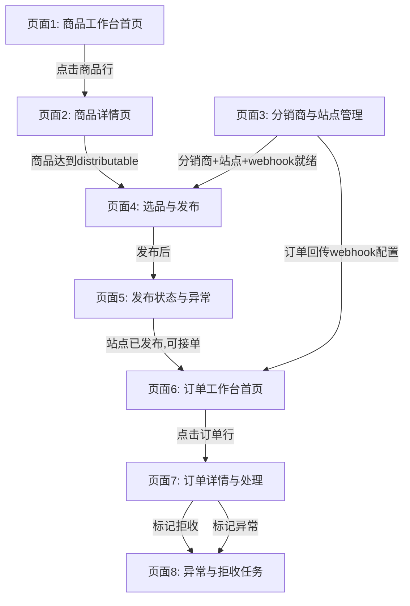

# 页面依赖验证

> 所属：`09-原型设计与验证/00-索引与验收.md`
> 覆盖验收标准：AC-5（页面 3 在页面 4 之前或同时可用）

---

> 覆盖 Gate 4 验收标准 AC-5：页面 3（分销商管理）必须在页面 4（选品发布）之前或同时可用。

## 1. 页面依赖关系图

## 2. 关键依赖验证清单

| 依赖关系 | 上游页面 | 下游页面 | 验证方式 | 阻塞时行为 |
|---------|---------|---------|---------|-----------|
| 商品→选品 | 页面 2 | 页面 4 | 页面 4 只显示 distributable 商品 | 无可分销商品时列表为空，提示"暂无可分销商品" |
| 分销商→选品 | 页面 3 | 页面 4 | 页面 4 加载时检查分销商+站点是否存在 | 无数据时显示引导提示，链接到页面 3 |
| Webhook→发布 | 页面 3 | 页面 4 | 发布按钮检查目标站点 webhook 配置 | 未配置时按钮灰置，提示"请先配置站点 webhook" |
| Webhook→订单接入 | 页面 3 | 页面 6 | 订单回传依赖站点侧 webhook 配置 | 非系统阻塞（站点侧配置），页面 3 提供复制回传地址功能 |
| 发布→订单 | 页面 4/5 | 页面 6 | 站点有已发布商品后才会产生订单 | 非系统阻塞（业务自然顺序） |
| 订单→拒收任务 | 页面 7 | 页面 8 | 标记拒收自动创建任务 | 系统自动，无需人工干预 |

## 3. AC-5 专项验证

**验证场景**：页面 3 必须在页面 4 之前或同时可用。

| 验证项 | 操作 | 预期结果 | 通过标准 |
|--------|------|---------|---------|
| V1 | 未创建任何分销商时访问页面 4 | 显示引导提示，链接到页面 3 | 提示可见且链接可跳转 |
| V2 | 创建分销商但未创建站点时访问页面 4 | 显示引导提示："请先添加站点" | 提示可见 |
| V3 | 创建站点但未配置 webhook 时尝试发布 | 发布按钮灰置，提示"请先配置 webhook" | 按钮不可点击 |
| V4 | 完成页面 3 全部配置后访问页面 4 | 页面正常加载，可选品可发布 | 功能正常 |
| V5 | 导航栏中页面 3 和页面 4 同时可见 | 两个页面入口同时存在于分销模块导航中 | 导航可见 |

---
