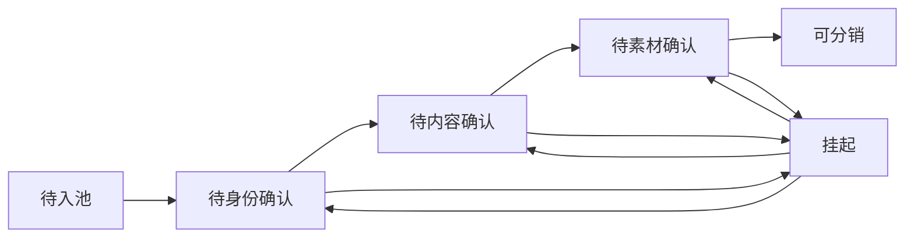
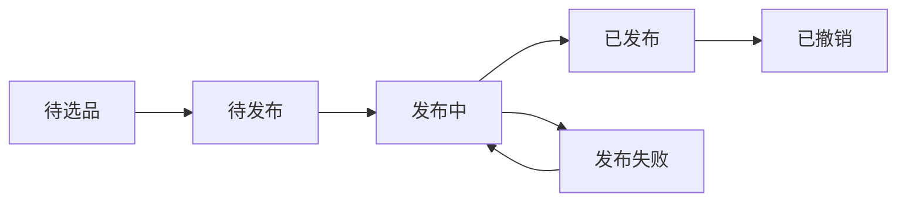
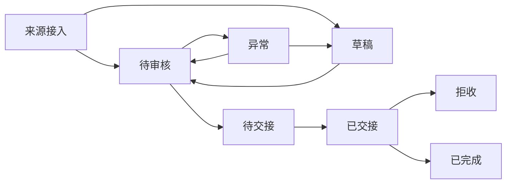

# Vaultcare 状态机与 API 草图

> 日期：2026-03-08
> 状态：设计版
> 作用：作为后端建模、接口拆分、状态流转开发的输入文档
> 上位文档：
> - `01-中台总方案.md`
> - `02-一期模块与页面设计.md`
> - `03-门禁与阶段规划.md`
> - `04-页面字段字典.md`

---

## 1. 文档定位

这份文档不追求把每个接口写到 Swagger 级别，而是先给出：

1. 三个模块的一期状态机
2. 关键状态流转的门禁规则
3. 后端核心对象建议
4. API 分组和最小接口草图
5. webhook 接入草图

它的目标是让开发可以开始：

- 拆表
- 拆服务
- 拆接口
- 拆状态流转

---

## 2. 核心对象建议

## 2.1 商品域

- `Product`
  - 主商品对象
- `ProductAlias`
  - 商品旧码 / 来源编码映射
- `ProductTask`
  - 商品建档任务
- `ProductContentDraft`
  - 建档中的内容版本
- `ProductMedia`
  - 原图 / 处理图 / 主图 / 附图
- `ProductAISuggestion`
  - AI 翻译 / 规范化 / 优化建议

## 2.2 分销域

- `Distributor`
  - 分销商主档
- `DistributorSite`
  - 域名站点
- `SiteWebhook`
  - 双向 webhook 配置
- `ProductDistribution`
  - 商品到分销商的选品关系
- `SitePublishRecord`
  - 商品到站点的发布关系与回执
- `DistributionAuditLog`
  - 分销关键动作留痕

## 2.3 订单域

- `Order`
  - 主订单
- `OrderItem`
  - 订单商品项
- `OrderSourceRecord`
  - 订单来源记录（WordPress / 手动）
- `OrderReviewRecord`
  - 审核记录
- `OrderHandoffRecord`
  - 交接记录
- `OrderExceptionTask`
  - 异常任务 / 拒收任务
- `OrderAuditLog`
  - 订单关键动作留痕

---

## 3. 商品模块状态机

### 3.1 商品状态定义

| 状态 | 说明 | 谁可操作 |
|---|---|---|
| 待入池 | 原始资料进入但未开始处理 | 系统 |
| 待身份确认 | 待确认主商品身份、供应商、货权类型 | 运营审单 |
| 待内容确认 | 待确认标题、卖点、描述、价格、分类 | 运营审单 |
| 待素材确认 | 待确认主图和素材质量 | 运营审单 |
| 可分销 | 满足门禁，可进入分销模块 | 系统计算 / 运营确认 |
| 挂起 | 信息不足、疑似重复、待补资料 | 运营审单 |

### 3.2 商品流转硬门禁

- `待身份确认 -> 待内容确认`
  - 主商品身份已确认
  - 供应商已绑定
  - 货权类型已标记

- `待内容确认 -> 待素材确认`
  - 标题、卖点、描述、价格、分类已确认
  - AI 建议已人工确认或明确忽略

- `待素材确认 -> 可分销`
  - 至少 1 张主图
  - 图片尺寸达标
  - 图片质量达标
  - 目标市场已指定

### 3.3 商品核心动作

- 入池
- 归并 / 新建主商品
- 绑定供应商
- 选择货权类型
- 提交 AI 翻译
- 提交 AI 规范化
- 提交 AI 优化
- 接受 / 拒绝 AI 建议
- 上传素材
- 确认主图
- 标记可分销
- 挂起 / 恢复

---

## 4. 分销模块状态机

### 4.1 分销状态定义

| 状态 | 说明 | 谁可操作 |
|---|---|---|
| 待选品 | 商品还未分发给分销商 / 站点 | 运营审单 |
| 待发布 | 已选品，待发到具体站点 | 运营审单 |
| 发布中 | 已发起站点发布请求 | 系统 |
| 已发布 | 发布成功并收到回执 | 系统 |
| 发布失败 | 发布失败，可重试 | 系统 |
| 已撤销 | 已撤销站点发布 | 运营审单 |

### 4.2 分销流转硬门禁

- `待选品 -> 待发布`
  - 商品状态为 `可分销`
  - 分销商已启用
  - 目标站点存在

- `待发布 -> 发布中`
  - 域名已配置
  - 发布 webhook 已启用
  - 商品与市场模板匹配

- `发布中 -> 已发布`
  - 收到成功回执

- `发布中 -> 发布失败`
  - 收到失败回执或超时失败

- `发布失败 -> 发布中`
  - 允许单站重试

### 4.3 分销核心动作

- 创建分销商
- 新增站点
- 配置发布 webhook
- 配置订单回传 webhook
- 测试 webhook
- 选品
- 发布
- 撤销
- 重试

### 4.4 分销动作留痕

必须写入留痕的动作：

- 选品
- 发布
- 撤销
- 重试

建议留痕字段：

- action_type
- actor_id
- actor_name
- target_type
- target_id
- result_status
- result_message
- created_at

---

## 5. 订单模块状态机

### 5.1 订单状态定义

| 状态 | 说明 | 谁可操作 |
|---|---|---|
| 来源接入 | 系统已接收订单来源 | 系统 |
| 草稿 | 非网站渠道手动录入，待客人确认 | 运营审单 |
| 待审核 | 可进入正式审单队列 | 运营审单 |
| 待交接 | 审核通过，待交给履约侧 | 运营审单 |
| 已交接 | 已完成交接记录 | 运营审单 |
| 异常 | 信息缺失、路由不明、需补充 | 运营审单 |
| 拒收 | 履约结果为拒收 | 系统/运营审单 |
| 已完成 | 履约结果为完成 | 系统/运营审单 |

### 5.2 订单来源规则

#### A. WordPress 网站订单

- 通过订单回传 webhook 自动进入统一订单池
- 默认直接进入 `待审核`
- 不经过 `草稿`

#### B. 非网站渠道订单

- 由运营手动录入
- 先进入 `草稿`
- 客人明确确认后提交 `待审核`

### 5.3 订单流转硬门禁

- `草稿 -> 待审核`
  - 客人已确认
  - 联系信息完整
  - 商品信息明确
  - 来源渠道明确

- `待审核 -> 待交接`
  - 订单信息完整
  - 拆单判断已完成
  - 履约路由已明确
  - 无阻断异常

- `待交接 -> 已交接`
  - 已生成交接记录
  - 交接对象明确

- `已交接 -> 拒收`
  - 履约结果返回拒收
  - 自动创建拒收任务

- `已交接 -> 已完成`
  - 履约结果返回完成

### 5.4 订单核心动作

- WordPress webhook 接单
- 手动创建草稿
- 编辑草稿
- 提交待审核
- 审核通过
- 审核驳回 / 标记异常
- 确认拆单
- 选择履约路由
- 创建交接记录
- 标记拒收
- 标记完成
- 关闭异常任务 / 拒收任务

### 5.5 订单动作留痕

必须写入留痕的动作：

- 草稿创建
- 草稿修改
- 提交待审核
- 审核
- 交接
- 标记拒收
- 标记完成

---

## 6. WordPress 与 webhook 草图

## 6.1 双向 webhook

### 发布推送 webhook

- 用途：商品发布到站点
- 触发：分销模块发起发布 / 撤销 / 重试
- 方向：中台 -> 站点

### 订单回传 webhook

- 用途：站点订单进入统一订单池
- 触发：站点产生订单
- 方向：站点 -> 中台

## 6.2 订单回传最小字段建议

| 字段 | 说明 |
|---|---|
| site_id | 来源站点 |
| domain | 来源域名 |
| external_order_no | 外部订单号 |
| customer_name | 客户姓名 |
| customer_phone | 电话 |
| customer_address | 地址 |
| items | 商品明细 |
| created_at | 订单创建时间 |

## 6.3 发布回执最小字段建议

| 字段 | 说明 |
|---|---|
| site_id | 目标站点 |
| master_code | 商品主编码 |
| action | publish / revoke / retry |
| status | success / failed |
| message | 结果说明 |
| external_ref | 外部引用 |
| returned_at | 回执时间 |

---

## 7. API 分组草图

## 7.1 商品模块 API

### 商品工作台

- `GET /api/product-tasks`
  - 列表、筛选、统计
- `POST /api/product-tasks/import`
  - 导入来源资料
- `GET /api/product-tasks/{id}`
  - 获取任务详情
- `PATCH /api/product-tasks/{id}`
  - 更新任务内容
- `POST /api/product-tasks/{id}/confirm-identity`
  - 确认身份
- `POST /api/product-tasks/{id}/confirm-content`
  - 确认内容
- `POST /api/product-tasks/{id}/confirm-media`
  - 确认素材
- `POST /api/product-tasks/{id}/mark-publishable`
  - 标记可分销
- `POST /api/product-tasks/{id}/suspend`
  - 挂起

### AI 辅助

- `POST /api/products/{id}/ai/translate`
- `POST /api/products/{id}/ai/normalize`
- `POST /api/products/{id}/ai/optimize`
- `POST /api/products/batch/ai/optimize`
- `POST /api/products/{id}/ai/accept`
- `POST /api/products/{id}/ai/reject`

### 素材处理

- `POST /api/products/{id}/media/upload`
- `POST /api/products/{id}/media/process`
- `POST /api/products/{id}/media/select-primary`
- `POST /api/products/{id}/media/reorder`

## 7.2 分销模块 API

### 分销商与站点

- `GET /api/distributors`
- `POST /api/distributors`
- `PATCH /api/distributors/{id}`
- `GET /api/distributor-sites`
- `POST /api/distributor-sites`
- `PATCH /api/distributor-sites/{id}`

### webhook

- `GET /api/distributor-sites/{id}/webhooks`
- `POST /api/distributor-sites/{id}/webhooks`
- `PATCH /api/distributor-sites/{id}/webhooks/{webhookId}`
- `POST /api/distributor-sites/{id}/webhooks/{webhookId}/test`

### 选品与发布

- `GET /api/distributions`
- `POST /api/distributions/select`
- `POST /api/distributions/publish`
- `POST /api/distributions/revoke`
- `POST /api/distributions/retry`
- `GET /api/distributions/publish-records`

## 7.3 订单模块 API

### 订单池

- `GET /api/orders`
- `GET /api/orders/{id}`
- `POST /api/orders/drafts`
  - 手动录入草稿
- `PATCH /api/orders/{id}/draft`
  - 编辑草稿
- `POST /api/orders/{id}/submit-review`
  - 草稿提交待审核

### 审核与交接

- `POST /api/orders/{id}/review`
  - 审核通过 / 驳回 / 异常
- `POST /api/orders/{id}/split`
  - 拆单确认
- `POST /api/orders/{id}/handoff`
  - 创建交接记录

### 异常与拒收任务

- `GET /api/order-tasks`
- `GET /api/order-tasks/{id}`
- `PATCH /api/order-tasks/{id}`
- `POST /api/order-tasks/{id}/close`

### webhook 接单

- `POST /api/webhooks/orders/{siteId}`
  - WordPress 订单回传入口

---

## 8. 最小权限建议

| 角色 | 商品 | 分销 | 订单 |
|---|---|---|---|
| 老板 | 全部可看，可放行关键门禁 | 全部可看，可配置 | 全部可看 |
| 运营审单 | 可建档、确认、挂起、标记可分销 | 可选品、发布、重试 | 可创建草稿、审核、交接、处理异常 |
| 分销商 | 默认只读自身站点状态 | 查看自身发布结果 | 默认不直接处理订单 |
| 系统 | 执行状态流转和 webhook 回调 | 执行回执回写 | 执行自动接单和结果回写 |

---

## 9. 建议的开发拆解顺序

1. 先建核心对象
2. 再建状态机
3. 再建门禁和留痕
4. 再接页面
5. 最后接 webhook 和外部回传

如果顺序反过来，最容易出现“页面先能点、后端状态全乱”的问题。

---

## 10. 当前建议

这份文档确认后，开发就可以继续往下拆：

1. 数据表草图
2. 接口请求 / 响应样例
3. 状态流转测试用例
4. 模块开发里程碑
